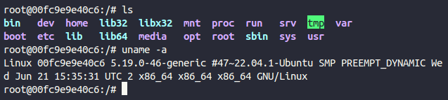

# Docker

Docker Image Repository

- https://hub.docker.com/

On this site, you can find official and community images to user on containers with Docker.

## Running a Ubuntu Image

```sh
$ docker run ubuntu
```

Command to interact with the image terminal

```sh
$ docker run -it ubuntu
```



_To close the image, run `exit` command_

## Check executed containers

These two commands below (`docker ps`, `docker container ls`) show the containers that are actually running

```sh
$ docker ps
CONTAINER ID   IMAGE     COMMAND   CREATED   STATUS    PORTS     NAMES
```

```sh
$ docker container ls
CONTAINER ID   IMAGE     COMMAND   CREATED   STATUS    PORTS     NAMES
```

With the flag `-a`, we can get a list of all containers that were executed. It is useful to understand what are been executed and what is happening on our environment.

```sh
$ docker ps -a
CONTAINER ID   IMAGE                  COMMAND                  CREATED          STATUS                      PORTS     NAMES
00fc9e9e40c6   ubuntu                 "bash"                   11 minutes ago   Exited (0) 3 minutes ago              frosty_herschel
68ea299af0bd   ubuntu                 "bash"                   11 minutes ago   Exited (0) 11 minutes ago             optimistic_cartwright
0f2707de7539   ubuntu                 "bash"                   12 minutes ago   Exited (0) 12 minutes ago             goofy_yonath
4be950f65a1a   ubuntu                 "bash"                   15 minutes ago   Exited (0) 15 minutes ago             busy_faraday
243d4edcbe7c   demo:latest            "/bin/sh -c /usr/loc…"   5 months ago     Exited (1) 5 months ago               demo_app
4d04a3ab1831   unico1-python_v3.6.8   "python app/index.py"    5 months ago     Exited (0) 5 months ago               priceless_cori
```

```sh
$ docker container -a
CONTAINER ID   IMAGE                  COMMAND                  CREATED          STATUS                      PORTS     NAMES
00fc9e9e40c6   ubuntu                 "bash"                   11 minutes ago   Exited (0) 3 minutes ago              frosty_herschel
68ea299af0bd   ubuntu                 "bash"                   11 minutes ago   Exited (0) 11 minutes ago             optimistic_cartwright
0f2707de7539   ubuntu                 "bash"                   12 minutes ago   Exited (0) 12 minutes ago             goofy_yonath
4be950f65a1a   ubuntu                 "bash"                   15 minutes ago   Exited (0) 15 minutes ago             busy_faraday
243d4edcbe7c   demo:latest            "/bin/sh -c /usr/loc…"   5 months ago     Exited (1) 5 months ago               demo_app
4d04a3ab1831   unico1-python_v3.6.8   "python app/index.py"    5 months ago     Exited (0) 5 months ago               priceless_cori
```

## Using containers with interaction

- You can run a container an let it executing on terminal;
- Use the flag `-it`;
- With this way, we can execute commands available on the container;
- We can use node image to this.

```sh
$ docker run -it node
Welcome to Node.js v19.4.0.
Type ".help" for more information.
> console.log("hello world")
hello world
undefined
> 20+20
40
> var x = 10
undefined
> x
10
```

OBS:
_Running `docker ps` in other terminal, you can see the status of the node image while it is running_

```sh
$ docker ps
[sudo] password for acer:
CONTAINER ID   IMAGE     COMMAND                  CREATED          STATUS          PORTS     NAMES
0e4b54e492f5   node      "docker-entrypoint.s…"   20 seconds ago   Up 19 seconds             sleepy_mayer
```

## Container X Virtual Machine

- Container is an application that serves a certain purpose. Its size is determined by just a few mbs;
- Virtual Machines has a own operational system with large GBS. Can execute multiple functions at the same time;
- Containers spend much less resources due to specific usage;
- VMs spend more resources, but execute multiple functions.
